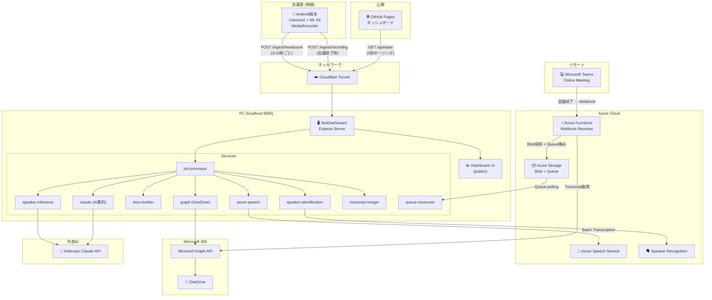
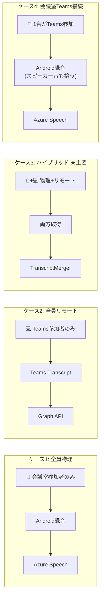

# 1. システム全体概要

**最終更新**: 2026-05-15

---

## 1.1 プロジェクトの目的

余った Android 端末を **会議室の滞在人数 IoT センサー** として再利用し、さらに **会議の議事録を自動生成** するシステム。

### 主要機能

| 機能 | 概要 |
|---|---|
| **滞在人数カウント (W1)** | Android CameraX + ML Kit で顔検出し、リアルタイムにダッシュボードへ反映 |
| **議事録自動生成 (W2-W3)** | 会議室の音声を録音 → 文字起こし → AI要約 → Word文書生成 → OneDrive保存 |
| **Teams連携 (P4)** | Teams会議のLive Transcriptを自動取得し、物理参加者の発言とマージ |
| **話者識別** | 声紋プロファイルによる自動話者識別 + LLM推定 |

---

## 1.2 システム全体アーキテクチャ



---

## 1.3 4つの会議シナリオ



| ケース | 物理参加 | Teams | 議事録生成元 |
|---|---|---|---|
| 1. 全員物理 | ◯ | × | Android録音 → Azure Speech |
| 2. 全員リモート | × | ◯ | Teams Live Transcript |
| 3. ハイブリッド | ◯ | ◯ | **両方をマージ** |
| 4. 会議室Teams接続 | ◯ | × | Android録音のみ |

---

## 1.4 会議室マッピング

| device_id | 会議室 | 階 | 定員 |
|---|---|---|---|
| `AA:11:11:11:11:11` | 大会議室 | 3F | 10名 |
| `3F:A8:91:0C:7B:E2` | 中会議室 | 2F | 6名 |
| `CC:33:33:33:33:33` | 小会議室 | 2F | 2名 |
| `DD:44:44:44:44:44` | 個別ブース | 1F | 1名 |

---

## 1.5 ディレクトリ構成

```
C:\PRJ2\dev2\
├── README.md                          全体ナビゲーション
├── doc/                               ★ 本設計書
│
├── OccupancyCounter/                  ★ Android アプリ
│   ├── app/src/main/java/.../
│   │   ├── MainActivity.kt            カメラ + 顔検出メイン
│   │   ├── FaceAnalyzer.kt            ML Kit 顔分析
│   │   ├── ServerClient.kt            HTTP 送信クライアント
│   │   ├── AppPrefs.kt                設定管理
│   │   ├── SettingsActivity.kt        設定画面
│   │   └── meeting/
│   │       ├── MeetingActivity.kt     録音UI画面
│   │       ├── MeetingRecorder.kt     MediaRecorder ラッパー
│   │       ├── RecordingUploader.kt   OkHttp multipart アップロード
│   │       └── JobStore.kt            ジョブ状態管理
│   └── docs/                          GitHub Pages (ダッシュボード)
│       ├── index.html
│       ├── dashboard.js
│       └── style.css
│
├── TestDashboard/                     ★ Express バックエンド
│   ├── server.js                       メインサーバー (全ルート)
│   ├── services/
│   │   ├── job-processor.js            ジョブ処理パイプライン
│   │   ├── azure-speech.js             Azure Speech API連携
│   │   ├── claude.js                   Claude AI 要約
│   │   ├── docx-builder.js             Word文書生成
│   │   ├── graph.js                    Microsoft Graph連携
│   │   ├── speaker-identification.js   声紋による話者識別
│   │   ├── speaker-inference.js        LLM 話者推定
│   │   ├── speaker-profiles.js         話者プロファイル管理
│   │   ├── speaker-recognition.js      Azure Speaker Recognition
│   │   ├── transcript-merger.js        物理/Teams発言マージ
│   │   ├── queue-consumer.js           Azure Queue ポーリング
│   │   ├── audio-publisher.js          音声ファイル公開
│   │   ├── audio-segments.js           音声セグメント分割
│   │   └── env-loader.js              環境変数ローダー
│   ├── prompts/                        Claude プロンプトテンプレート
│   ├── public/                         ローカルダッシュボード UI
│   ├── storage/                        永続データ
│   │   ├── jobs/                       ジョブ状態 JSON
│   │   ├── transcripts/               文字起こし結果
│   │   └── minutes/                    生成済み .docx
│   └── test/                           テストコード
│
├── functions/                         ★ Azure Functions
│   ├── notifications/                  Teams Webhook受信
│   │   ├── function.json
│   │   └── index.js
│   └── host.json
│
├── infra/                             ★ インフラ
│   ├── bicep/
│   │   ├── main.bicep                  メインテンプレート
│   │   └── modules/
│   │       ├── storage.bicep           Storage Account
│   │       ├── speech.bicep            Speech Service
│   │       └── functions.bicep         Function App
│   ├── deploy-azure.ps1               デプロイスクリプト
│   └── serena/                         Serena 連携
│
└── scripts/                           ★ 運用スクリプト
    ├── run-smoke-test.ps1              スモークテスト
    └── rotate-azurite-log.ps1          ログローテーション
```

---

## 1.6 実装ステータス

| 機能ID | 内容 | ステータス |
|---|---|---|
| W1 | 滞在人数カウント・ダッシュボード | ✅ 本番稼働中 |
| W2 | 音声録音 → Azure Speech 文字起こし | ✅ 実装済み |
| W3 | Claude AI 議事録生成 → DOCX → OneDrive | ✅ 実装済み |
| P4 | Teams Webhook → Queue → 自動連携 | ✅ 実装済み (Azure実機未テスト) |
| P5 | Azurite ログローテーション | ✅ 運用中 |
| — | 話者プロファイル登録・音声照合 | ✅ 実装済み |
| — | LLM 話者推定 | ✅ 実装済み |
