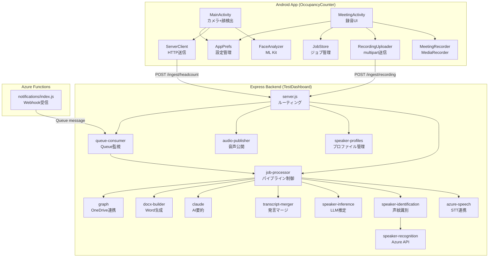
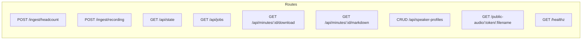
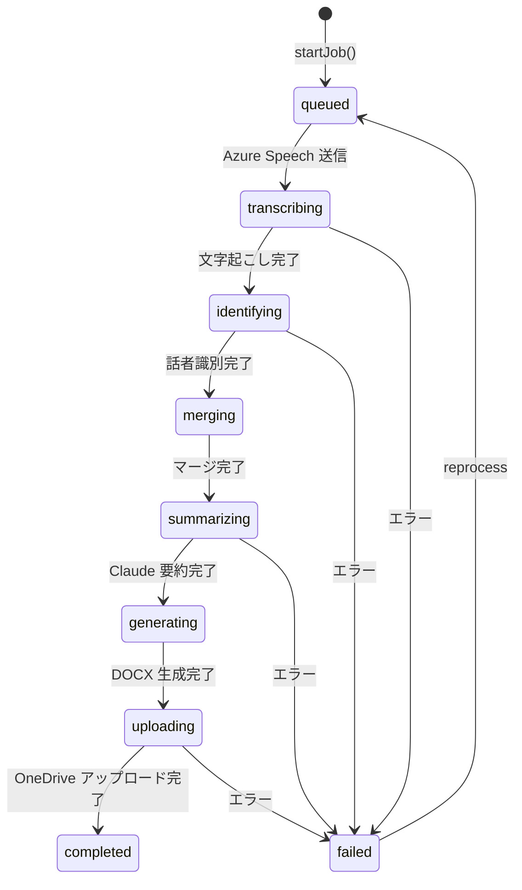

# 2. コンポーネント設計

**最終更新**: 2026-05-15

---

## 2.1 コンポーネント全体関連図

---

## 2.2 Android App コンポーネント

### MainActivity (7,590 bytes)

| 項目 | 内容 |
|---|---|
| 責務 | CameraX プレビュー表示、ML Kit 顔検出、定期的にサーバーへ人数送信 |
| 依存 | FaceAnalyzer, ServerClient, AppPrefs |
| ライフサイクル | Activity起動 → カメラ許可 → プレビュー開始 → 顔検出ループ |

### FaceAnalyzer (2,033 bytes)

| 項目 | 内容 |
|---|---|
| 責務 | CameraX ImageAnalysis から ML Kit Face Detection を実行 |
| 入力 | ImageProxy (カメラフレーム) |
| 出力 | 検出された顔の数 (headcount) |
| 方式 | スナップショット型 (直近5フレームの最頻値) |

### ServerClient (2,908 bytes)

| 項目 | 内容 |
|---|---|
| 責務 | OkHttp で Express サーバーへ JSON POST |
| エンドポイント | `POST /ingest/headcount` |
| ペイロード | `{ device_id, headcount, confidence }` |

### meeting/MeetingRecorder (5,146 bytes)

| 項目 | 内容 |
|---|---|
| 責務 | MediaRecorder のラッパー。m4a/AAC 64kbps mono 録音 |
| 設定 | サンプルレート 16kHz, モノラル, AAC 64kbps |
| 出力 | `.m4a` ファイル |

### meeting/MeetingActivity (12,308 bytes)

| 項目 | 内容 |
|---|---|
| 責務 | 録音UI画面。「会議開始」「終了して送信」ボタン、録音同意ダイアログ |
| 依存 | MeetingRecorder, RecordingUploader, JobStore, AppPrefs |

### meeting/RecordingUploader (5,652 bytes)

| 項目 | 内容 |
|---|---|
| 責務 | OkHttp multipart/form-data で音声ファイルをサーバーへアップロード |
| エンドポイント | `POST /ingest/recording` |
| ペイロード | meta (JSON) + audio (m4a binary) |

### meeting/JobStore (11,671 bytes)

| 項目 | 内容 |
|---|---|
| 責務 | Android側でのジョブ状態管理。サーバーのジョブ状態をポーリングで同期 |

---

## 2.3 Express Backend コンポーネント

### server.js (18,649 bytes) — メインサーバー

| 項目 | 内容 |
|---|---|
| 責務 | 全ルート定義、CORS設定、multer multipart受信、状態管理 |
| ポート | 3000 (環境変数 PORT で変更可) |
| ミドルウェア | CORS, express.json(1mb), express.static, multer |
| 状態管理 | メモリ保持 (rooms/history) + storage/jobs/ へ永続化 |

### job-processor.js (19,710 bytes) — パイプライン制御

| 項目 | 内容 |
|---|---|
| 責務 | 録音受信後の全処理パイプラインを非同期で制御 |
| ジョブ永続化 | `storage/jobs/<jobId>.json` に状態スナップショットを保存 |
| 起動時復元 | サーバー再起動時に `loadPersistedJobs()` で自動復元 |
| 入口 | `startJob()` (物理録音), `startJobFromTeams()` (Teams連携) |

### azure-speech.js (8,754 bytes)

| 項目 | 内容 |
|---|---|
| 責務 | Azure Speech Batch Transcription API との連携 |
| モック | `AZURE_SPEECH_MOCK=true` でローカルテスト可 |
| API | REST API v3.1 Batch Transcription |
| 話者分離 | diarizationEnabled=true (2-8話者) |
| ポーリング | 30秒間隔、タイムアウト30分 |

### claude.js (7,973 bytes)

| 項目 | 内容 |
|---|---|
| 責務 | Anthropic Claude API による議事録要約 |
| モデル | claude-sonnet-4-5 (環境変数 CLAUDE_MODEL) |
| モック | `CLAUDE_MOCK=true` でローカルテスト可 |
| プロンプト | `prompts/meeting-minutes-ja.md` |
| 出力 | 構造化 Markdown (サマリ/議題/決定事項/アクションアイテム) |

### docx-builder.js (7,733 bytes)

| 項目 | 内容 |
|---|---|
| 責務 | Claude が生成した Markdown を Word (.docx) に変換 |
| ライブラリ | `docx` npm パッケージ v8.5 |
| セクション | ヘッダー / メタ情報テーブル / サマリ / 議題 / 発言 / 決定事項 / AI / フッター |

### graph.js (13,992 bytes)

| 項目 | 内容 |
|---|---|
| 責務 | Microsoft Graph API 連携 (OneDrive アップロード, VTT取得) |
| 認証 | client_credentials flow (Azure AD App) |
| 機能 | ファイルアップロード, 共有リンク作成, VTTパース |

### speaker-identification.js (8,384 bytes)

| 項目 | 内容 |
|---|---|
| 責務 | Azure Speaker Recognition による声紋ベース話者識別 |
| 方式 | 各話者の代表音声セグメントを切出し → Identification API |
| 信頼度 | ≥0.85 自動適用 / ≥0.6 候補表示 / <0.6 不明 |

### speaker-inference.js (6,285 bytes)

| 項目 | 内容 |
|---|---|
| 責務 | Claude を使った文脈ベースの話者推定 (Level 3) |
| 入力 | 未識別の話者セグメント + 参加者リスト |
| 出力 | 推定結果 (名前 + 信頼度 + 根拠) |

### transcript-merger.js (7,399 bytes)

| 項目 | 内容 |
|---|---|
| 責務 | 物理参加者 (Room) と Teams 参加者の発言を時系列マージ |
| 重複除去 | 0.5秒以内の同一話者発言をマージ (Teams優先: 実名あり) |

### queue-consumer.js (6,496 bytes)

| 項目 | 内容 |
|---|---|
| 責務 | Azure Queue Storage からメッセージをポーリングし、Teams Transcript ジョブを起動 |
| ポーリング間隔 | 30秒 |
| モック | `AZURE_STORAGE_CONNECTION_STRING` 未設定時は自動モック |

---

## 2.4 Azure Functions コンポーネント

### notifications/index.js

| 項目 | 内容 |
|---|---|
| 責務 | Microsoft Graph Webhook 通知の受信・検証・処理 |
| トリガー | HTTP Trigger (POST /api/notifications) |
| 処理 | Webhook検証 → Transcript取得 → Blob保存 → Queue積み |
| ライフサイクル通知 | reauthorizationRequired / subscriptionRemoved / missed |

---

## 2.5 フロントエンド コンポーネント

### GitHub Pages ダッシュボード (`OccupancyCounter/docs/`)

| ファイル | 責務 |
|---|---|
| `index.html` (5,552B) | ダッシュボード HTML構造 |
| `dashboard.js` (20,860B) | ポーリング・UI更新・議事録モーダル |
| `style.css` (12,545B) | レスポンシブデザイン・アニメーション |
| `config.js` (985B) | サーバーURL設定 |

### ローカルダッシュボード (`TestDashboard/public/`)

| ファイル | 責務 |
|---|---|
| `index.html` (8,303B) | ローカル版 ダッシュボード |
| `dashboard.js` (26,675B) | 拡張版UI (ジョブ管理・Speaker Profile管理含む) |
| `style.css` (14,156B) | ローカル版スタイル |
