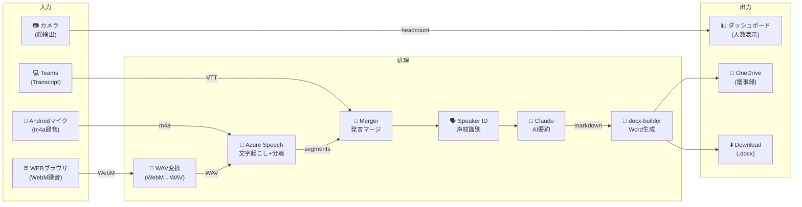
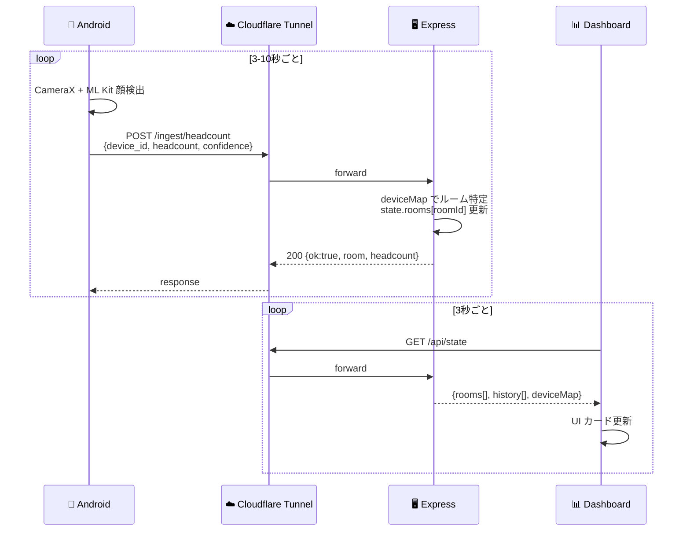
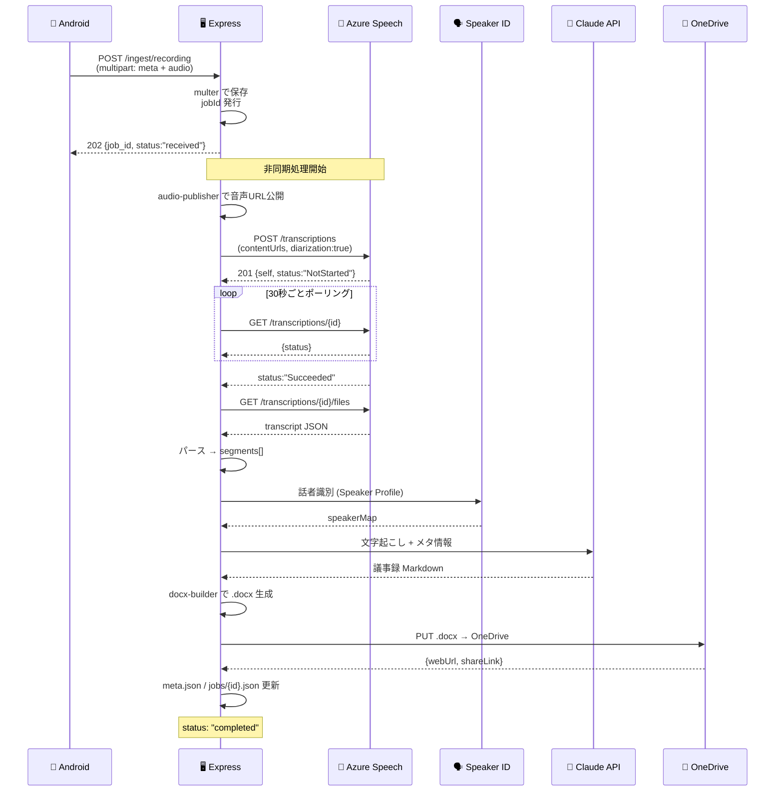
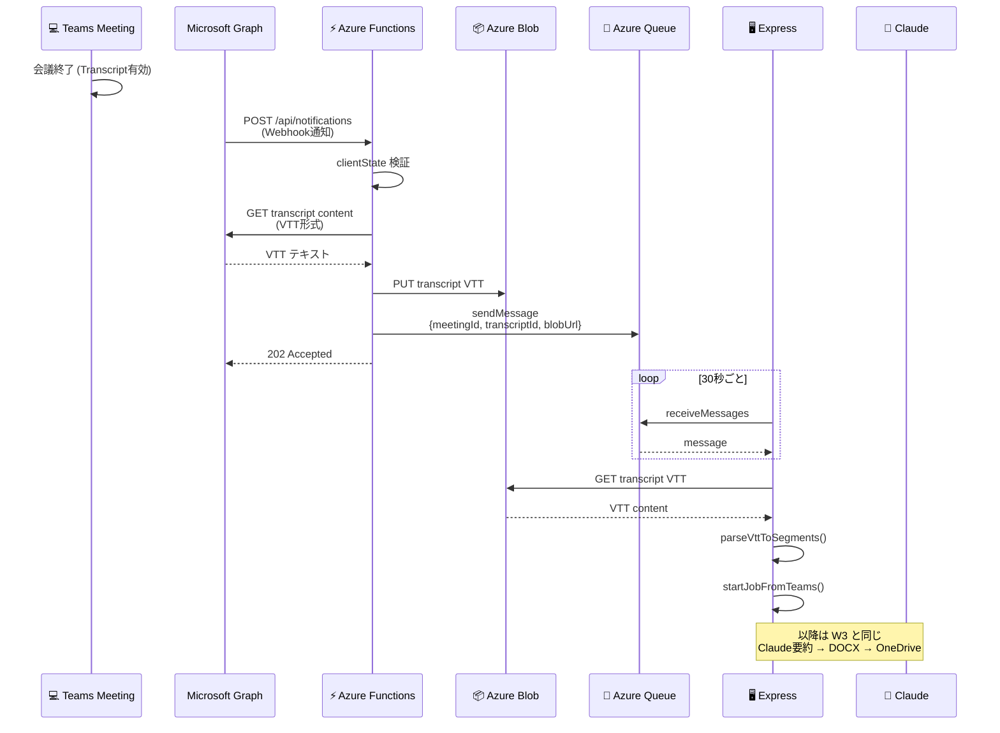
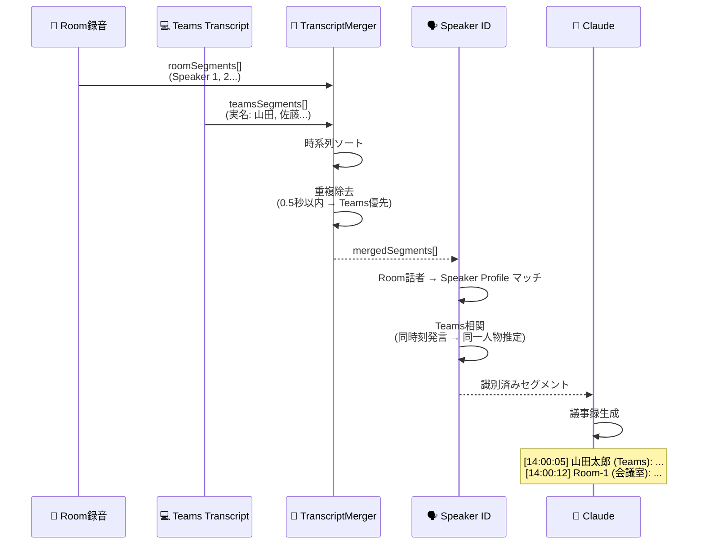
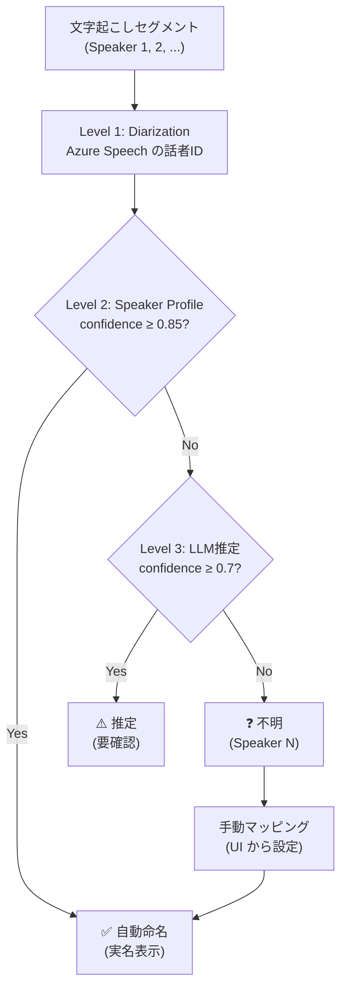
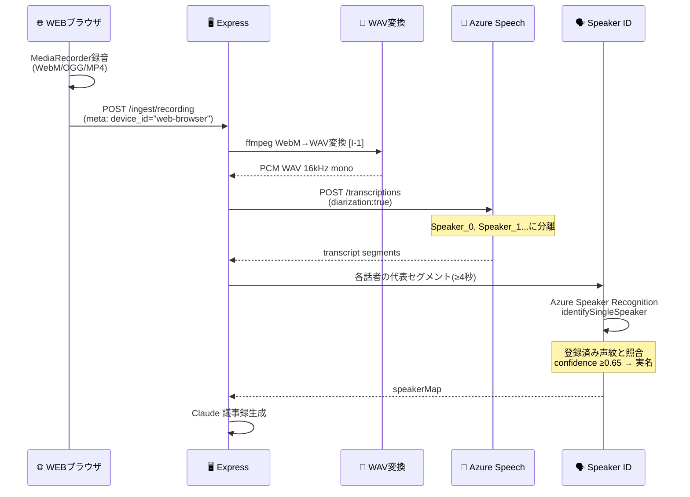
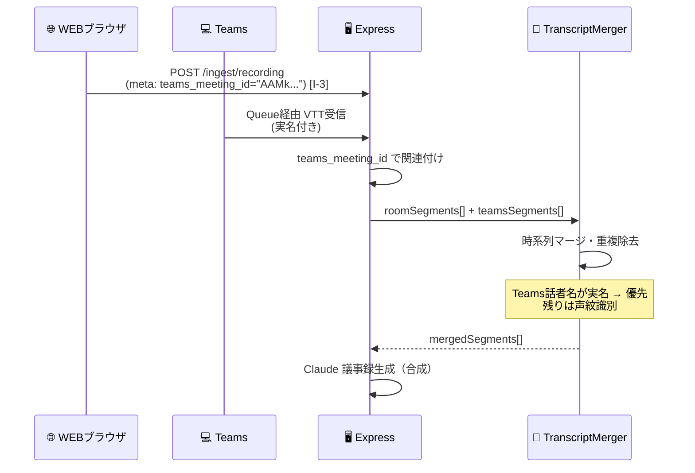
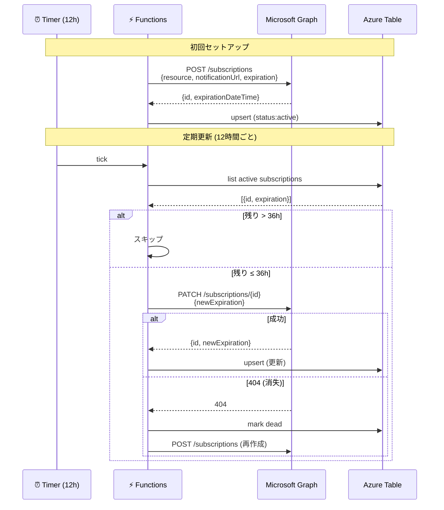

# 3. データフロー・シーケンス設計

**最終更新**: 2026-05-17

---

## 3.1 全体データフロー

---

## 3.2 滞在人数カウント (W1) シーケンス

---

## 3.3 議事録生成 (W2-W3) シーケンス — 物理参加者のみ

---

## 3.4 Teams Webhook 連携 (P4) シーケンス

---

## 3.5 ハイブリッド会議 マージフロー

---

## 3.6 話者識別 3レベルフロー

## 3.8 WEB録音 話者識別フロー（ケース5/6）★新

### ケース5: PCブラウザのみ

### ケース6: WEBブラウザ + Teams同時

---

