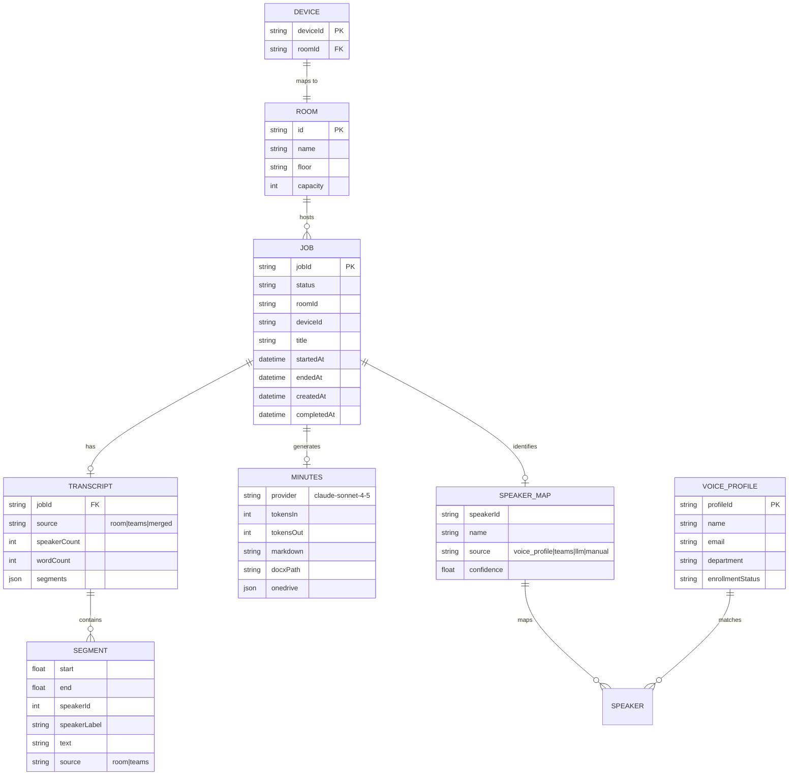
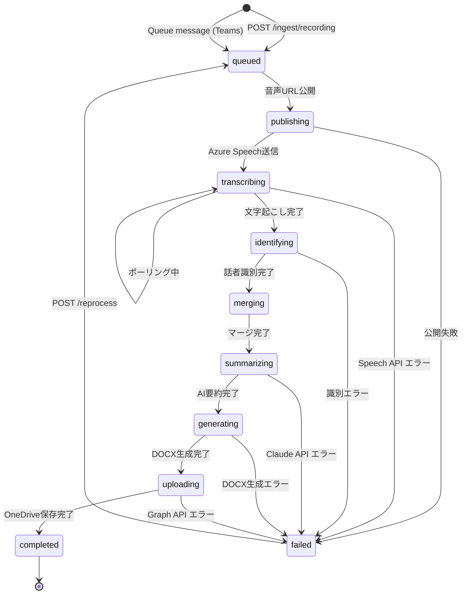
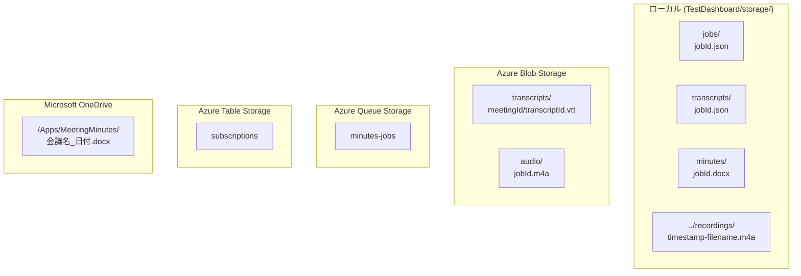

# 4. データモデル設計

**最終更新**: 2026-05-15

---

## 4.1 データモデル全体図



---

## 4.2 ジョブ状態遷移



---

## 4.3 ジョブ JSON (`storage/jobs/<jobId>.json`)

```json
{
  "jobId": "550e8400-e29b-41d4-a716-446655440000",
  "status": "completed",
  "createdAt": "2026-05-09T14:00:00+09:00",
  "completedAt": "2026-05-09T15:05:32+09:00",

  "meta": {
    "device_id": "3F:A8:91:0C:7B:E2",
    "room_id": "medium",
    "title": "週次定例MTG",
    "started_at": "2026-05-09T14:00:00+09:00",
    "ended_at": "2026-05-09T15:00:00+09:00",
    "language": "ja-JP"
  },

  "azureSpeech": {
    "mocked": false,
    "transcriptionUrl": "https://japaneast.api.cognitive.microsoft.com/speechtotext/v3.1/transcriptions/abc-123",
    "status": "Succeeded"
  },

  "publishedUrl": "https://meetminstxxx.blob.core.windows.net/audio/550e8400.m4a",
  "publishExpiresAt": "2026-05-09T15:00:00Z",

  "transcript": {
    "speakerCount": 4,
    "wordCount": 8421,
    "segments": [
      {
        "start": 0.0,
        "end": 3.2,
        "speakerId": 1,
        "speakerLabel": "山田太郎",
        "text": "おはようございます。本日の議題は...",
        "source": "room"
      }
    ],
    "speakerIdentification": { "Speaker 1": { "name": "山田太郎", "confidence": 0.92 } },
    "speakerInference": { "Speaker 2": { "name": "佐藤花子", "confidence": 0.78 } }
  },

  "minutes": {
    "provider": "claude-sonnet-4-5",
    "model": "claude-sonnet-4-5",
    "tokensIn": 12500,
    "tokensOut": 1850,
    "mocked": false,
    "generatedAt": "2026-05-09T15:04:10+09:00",
    "markdown": "# 会議サマリ\n...",
    "docxPath": "storage/minutes/550e8400.docx",
    "docxFilename": "週次定例MTG_20260509.docx",
    "docxSize": 8971,
    "onedrive": {
      "driveItemId": "01XXXX",
      "webUrl": "https://contoso-my.sharepoint.com/...",
      "shareLink": "https://contoso-my.sharepoint.com/:w:/g/..."
    }
  },

  "error": null
}
```

---

## 4.4 会議室状態 (メモリ)

```json
{
  "rooms": {
    "large": {
      "headcount": 8,
      "confidence": "confirmed",
      "lastUpdate": "2026-05-09T14:30:00Z",
      "deviceId": "AA:11:11:11:11:11"
    }
  },
  "history": {
    "large": [
      { "t": "2026-05-09T14:30:00Z", "n": 8, "c": "confirmed" }
    ]
  }
}
```

---

## 4.5 Speaker Profile (`storage/speaker-profiles.json`)

```json
{
  "profiles": [
    {
      "id": "spk-1778850000000-a1b2c3",
      "displayName": "山田太郎",
      "email": "yamada@contoso.com",
      "department": "開発部",
      "locale": "ja-JP",
      "azureProfileId": "abc-123-def",
      "profileStatus": "Active",
      "enrollmentStatus": "Enrolled",
      "enrollmentsCount": 1,
      "enrollmentsSpeechLengthInSec": 30.5,
      "remainingEnrollmentsSpeechLengthInSec": 0,
      "mocked": false,
      "createdAt": "2026-05-01T10:00:00+09:00",
      "updatedAt": "2026-05-01T10:05:00+09:00",
      "lastEnrollmentAt": "2026-05-01T10:05:00+09:00",
      "error": null
    }
  ]
}
```

---

## 4.6 ストレージ配置



---

## 4.7 Transcript Segment 統一フォーマット

Room (Azure Speech) と Teams (VTT) の両ソースを以下の統一フォーマットに正規化:

```typescript
interface Segment {
  start: number;          // 秒 (会議開始からの相対)
  end: number;            // 秒
  speakerId: number;      // Azure Speech: 1,2,3... / Teams: -1
  speakerLabel: string;   // "Speaker 1" or "山田太郎"
  text: string;           // 発言テキスト
  source: "room" | "teams";
  absoluteTimestamp?: string; // ISO8601
}
```
