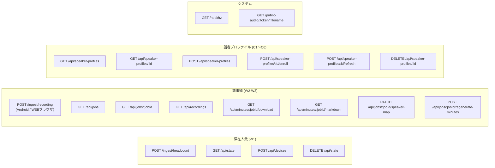
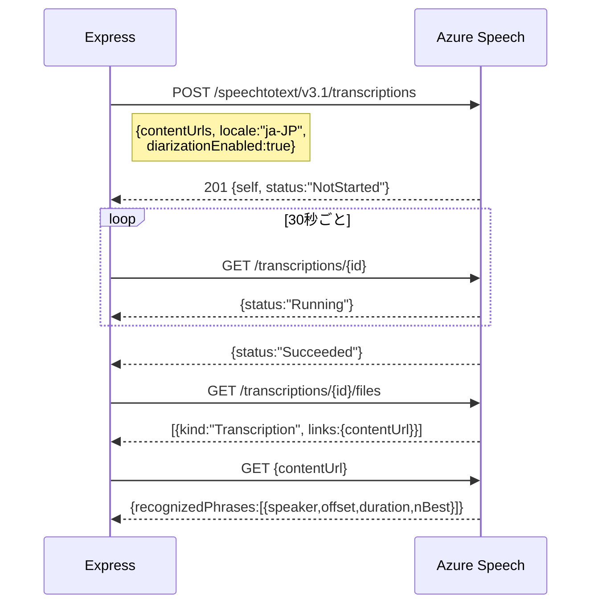
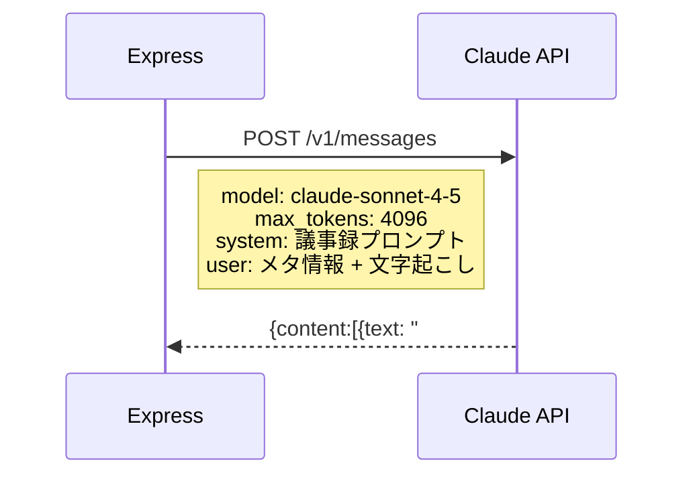

# 5. API設計

**最終更新**: 2026-05-17

---

## 5.1 内部 REST API 一覧



---

## 5.1a 話者プロファイルAPI 詳細

### GET `/api/speaker-profiles`

登録済み声紋プロファイル一覧取得。

**Response (200):**
```json
{
  "profiles": [
    {
      "id": "spk-xxx",
      "displayName": "山田太郎",
      "email": "yamada@contoso.com",
      "department": "開発部",
      "enrollmentStatus": "Enrolled",
      "enrollmentsCount": 1,
      "enrollmentsSpeechLengthInSec": 30.5,
      "remainingEnrollmentsSpeechLengthInSec": 0,
      "mocked": false
    }
  ]
}
```

### POST `/api/speaker-profiles`

新規声紋プロファイル作成（Azure Speaker Recognition Profile作成）。

**Request (multipart または JSON):**
```json
{
  "displayName": "山田太郎",
  "email": "yamada@contoso.com",
  "department": "開発部",
  "locale": "ja-JP"
}
```
> `audio` パートを同時送信すると登録（enroll）まで行う（任意）

### POST `/api/speaker-profiles/:id/enroll`

声紋音声サンプルを登録（WAV PCM推奨、≥20秒）。

| 項目 | 内容 |
|---|---|
| Content-Type | multipart/form-data |
| `audio` パート | WAV PCM (16kHz, mono) ≥20秒 |
| `ignoreMinLength` | `"true"` でテスト時の長さ制限を無視 |

> WEBブラウザUIでは MediaRecorder で録音した WebM を送信し、サーバー側でWAVに変換する（I-1実装後）

---

## 5.2 エンドポイント詳細

### POST `/ingest/headcount`

Android からの人数データ受信。

| 項目 | 値 |
|---|---|
| Content-Type | application/json |
| 認証 | なし |

**Request:**
```json
{
  "device_id": "3F:A8:91:0C:7B:E2",
  "headcount": 5,
  "confidence": "confirmed"
}
```

**Response (200):**
```json
{ "ok": true, "room": "medium", "headcount": 5 }
```

**Error (400):** `device_id` または `headcount` 欠落  
**Error (202):** 未登録 `device_id`

---

### POST `/ingest/recording`

Android または WEBブラウザからの会議音声受信。

| 項目 | 値 |
|---|---|
| Content-Type | multipart/form-data |
| サイズ上限 | 200MB |
| 認証 | なし |

**Request Parts:**

| Part | Type | 内容 |
|---|---|---|
| `meta` | application/json | `{job_id, device_id, room_id, title, started_at, ended_at, language, teams_meeting_id?}` |
| `audio` | audio/mp4 または audio/webm | m4a / WebM バイナリ |

> **WEB録音時の追加フィールド:**
> - `device_id`: `"web-browser"` (固定)
> - `teams_meeting_id`: Teams会議と連携する場合に指定 → ケース6ハイブリッド自動マージ起動
> - 音声形式: WebM/OGG/MP4（ブラウザのサポートする形式を自動選択）

**Response (202):**
```json
{
  "ok": true,
  "job_id": "test-001",
  "server_job_id": "test-001",
  "exists": true,
  "status": "received",
  "message": "transcription started"
}
```

---

### GET `/api/state`

ダッシュボード用の全会議室状態。

**Response (200):**
```json
{
  "serverTime": "2026-05-09T14:30:00Z",
  "rooms": [
    {
      "id": "large", "name": "大会議室", "floor": "3F",
      "capacity": 10, "headcount": 8,
      "confidence": "confirmed", "lastUpdate": "...", "deviceId": "..."
    }
  ],
  "deviceMap": { "AA:11:11:11:11:11": "large" },
  "history": { "large": [{ "t": "...", "n": 8, "c": "confirmed" }] }
}
```

---

### GET `/api/jobs`

ジョブ一覧 or 特定ジョブ検索。

| クエリ | 用途 |
|---|---|
| `?jobId=xxx` | ジョブIDで検索 (client_job_id も含む) |
| (なし) | 全件取得 |

**Response (200):**
```json
{
  "ok": true,
  "count": 3,
  "jobs": [
    {
      "jobId": "...", "clientJobId": "...",
      "status": "completed", "title": "...",
      "speakerCount": 4, "downloadUrl": "...", "markdownUrl": "..."
    }
  ]
}
```

---

### GET `/api/jobs/:jobId`

ジョブ詳細 (transcript, minutes含む)。

---

### GET `/api/minutes/:jobId/download`

生成された .docx ファイルのダウンロード。

| Header | 値 |
|---|---|
| Content-Type | application/vnd.openxmlformats-officedocument.wordprocessingml.document |
| Content-Disposition | attachment; filename="会議名.docx" |

---

### GET `/api/minutes/:jobId/markdown`

議事録 Markdown プレビュー。

| Header | 値 |
|---|---|
| Content-Type | text/markdown; charset=utf-8 |

---

### PATCH `/api/jobs/:jobId/speaker-map`

話者ラベルを手動でリマップし、議事録を再生成可能にする（I-4）。

**Request (JSON):**
```json
{
  "speakerMap": {
    "Speaker 0": "山田太郎",
    "Speaker 1": "佐藤花子"
  }
}
```

**Response (200):**
```json
{ "ok": true, "message": "Speaker map applied", "appliedAt": "2026-05-17T14:00:00+09:00" }
```

---

### POST `/api/jobs/:jobId/regenerate-minutes`

話者マップ適用後に議事録を再生成する（I-4）。  
SUMMARIZING → BUILDING_DOCX → UPLOADING → COMPLETED を再実行。

**Response (200):**
```json
{ "ok": true, "message": "Minutes regenerated", "status": "completed" }
```

---

### GET `/healthz`

ヘルスチェック。

**Response (200):**
```json
{ "ok": true, "ts": "2026-05-09T14:30:00Z" }
```

---

## 5.3 外部 API 連携

### Azure Speech — Batch Transcription API v3.1



**認証:** `Ocp-Apim-Subscription-Key` ヘッダー  
**リージョン:** japaneast  
**料金:** $1.40/時間

---

### Anthropic Claude API



**認証:** `x-api-key` ヘッダー  
**モデル:** claude-sonnet-4-5  
**料金:** $3/Mtok in, $15/Mtok out

---

### Microsoft Graph API

| 操作 | メソッド | エンドポイント |
|---|---|---|
| トークン取得 | POST | `login.microsoftonline.com/{tenant}/oauth2/v2.0/token` |
| OneDrive アップロード | PUT | `graph.microsoft.com/v1.0/users/{upn}/drive/root:/{path}:/content` |
| 共有リンク作成 | POST | `graph.microsoft.com/v1.0/drives/{id}/items/{id}/createLink` |
| Transcript取得 | GET | `graph.microsoft.com/v1.0/users/{id}/onlineMeetings/{id}/transcripts/{id}/content` |
| Subscription作成 | POST | `graph.microsoft.com/v1.0/subscriptions` |
| Subscription更新 | PATCH | `graph.microsoft.com/v1.0/subscriptions/{id}` |

**認証:** client_credentials flow (Azure AD App)

---

### Azure Speaker Recognition API

| 操作 | メソッド | エンドポイント |
|---|---|---|
| Profile作成 | POST | `/speaker/identification/v2.0/text-independent/profiles` |
| Enrollment | POST | `/profiles/{id}/enrollments` |
| Identification | POST | `/profiles/identifySingleSpeaker` |
| Profile削除 | DELETE | `/profiles/{id}` |

**認証:** `Ocp-Apim-Subscription-Key` ヘッダー

---

## 5.4 Azure Functions API

### POST `/api/notifications`

Microsoft Graph Webhook 通知受信。

**Request (Graph から):**
```json
{
  "value": [
    {
      "subscriptionId": "...",
      "clientState": "secret",
      "resource": "communications/onlineMeetings('AAMk...')/transcripts('MSMm...')",
      "changeType": "created"
    }
  ]
}
```

**検証 (subscription作成時):**
- `?validationToken=xxx` → そのまま 200 で返却

**Response:** 202 Accepted
