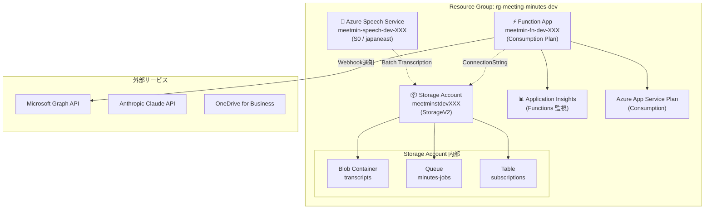
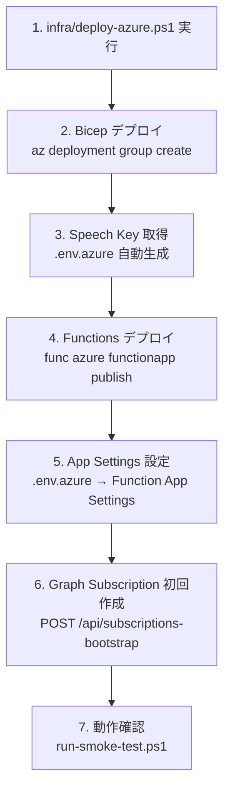
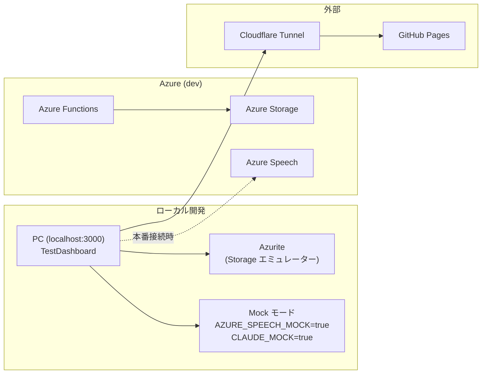

# 6. インフラ・デプロイ設計

**最終更新**: 2026-05-15

---

## 6.1 Azure リソース構成



---

## 6.2 Bicep テンプレート構成

```
infra/bicep/
├── main.bicep                  メインオーケストレーション
├── main.json                   コンパイル済み ARM テンプレート
├── parameters.local.json       ローカル用パラメータ
└── modules/
    ├── storage.bicep            Storage Account + Blob + Queue
    ├── speech.bicep             Azure Speech Service
    └── functions.bicep          Function App + App Service Plan + App Insights
```

### main.bicep パラメータ

| パラメータ | デフォルト | 説明 |
|---|---|---|
| `location` | japaneast | リソース配置リージョン |
| `projectName` | meetmin | リソース名プレフィックス (3-12文字) |
| `environment` | dev | 環境タグ (dev/stg/prod) |
| `speechSku` | S0 | Speech Service SKU (F0/S0) |
| `deployFunctions` | false | Functions をデプロイするか |

### Outputs

| 出力 | 用途 |
|---|---|
| `storageAccountName` | 接続文字列取得用 |
| `speechEndpoint` | Speech API エンドポイント |
| `speechRegion` | Speech リージョン |
| `functionAppName` | Functions デプロイ先 |
| `queueName` | Queue 名 (minutes-jobs) |
| `blobContainerName` | Blob コンテナ名 (transcripts) |

---

## 6.3 デプロイフロー



### デプロイコマンド

```powershell
# 1. Azure リソースデプロイ
az deployment group create `
  --resource-group rg-meeting-minutes-dev `
  --template-file infra/bicep/main.bicep `
  --parameters @infra/bicep/parameters.local.json

# 2. Functions デプロイ
cd functions
func azure functionapp publish $env:FUNCTION_APP_NAME

# 3. スモークテスト
.\scripts\run-smoke-test.ps1
```

---

## 6.4 環境構成



### 環境変数一覧

| 変数 | ローカル | Azure | 説明 |
|---|---|---|---|
| `AZURE_SPEECH_MOCK` | true | false | Speech API モック |
| `AZURE_SPEECH_KEY` | — | *(secret)* | Speech API キー |
| `AZURE_SPEECH_REGION` | — | japaneast | リージョン |
| `CLAUDE_MOCK` | true | false | Claude API モック |
| `ANTHROPIC_API_KEY` | — | *(secret)* | Claude APIキー |
| `CLAUDE_MODEL` | — | claude-sonnet-4-5 | モデル名 |
| `GRAPH_MOCK` | true | false | Graph API モック |
| `MS_TENANT_ID` | — | *(secret)* | Azure AD テナント |
| `MS_CLIENT_ID` | — | *(secret)* | アプリID |
| `MS_CLIENT_SECRET` | — | *(secret)* | クライアントシークレット |
| `MS_USER_UPN` | — | tsutsumi@... | Graph ユーザー |
| `MS_DRIVE_PATH` | — | /Apps/MeetingMinutes | OneDrive パス |
| `AZURE_STORAGE_CONNECTION_STRING` | UseDevelopmentStorage=true | *(secret)* | Storage接続 |
| `QUEUE_CONSUMER_MOCK` | true | true/false | admin consent完了まではtrue推奨 |
| `PUBLISH_MODE` | local | blob | 音声公開モード |
| `SPEAKER_RECOGNITION_MOCK` | true | false | 話者識別モック |
| `TESTDASHBOARD_API_KEY` | 空 | *(secret)* | 公開時の簡易APIキー |
| `PORT` | 3000 | 3000 | サーバーポート |
| `CORS_ORIGIN` | * | * | CORS設定 |

---

## 6.5 依存パッケージ

### TestDashboard

| パッケージ | バージョン | 用途 |
|---|---|---|
| express | ^4.19.2 | Web フレームワーク |
| multer | ^1.4.5-lts.1 | multipart ファイル受信 |
| docx | ^8.5.0 | Word 文書生成 |
| @azure/storage-blob | ^12.31.0 | Azure Blob Storage |
| @azure/storage-queue | ^12.29.0 | Azure Queue Storage |

### Azure Functions

| パッケージ | バージョン | 用途 |
|---|---|---|
| @azure/functions | ^4.5.0 | Functions ランタイム |
| @azure/identity | ^4.4.0 | Azure AD 認証 |
| @azure/storage-blob | ^12.24.0 | Blob Storage |
| @azure/storage-queue | ^12.23.0 | Queue Storage |
| @microsoft/microsoft-graph-client | ^3.0.7 | Graph API クライアント |
| axios | ^1.7.0 | HTTP クライアント |

### Android

| ライブラリ | 用途 |
|---|---|
| CameraX 1.3.1 | カメラ制御 |
| ML Kit Face Detection | 顔検出 |
| OkHttp 4.12.0 | HTTP通信 |
| MediaRecorder | 音声録音 |

---

## 6.6 コスト試算 (月間)

前提: 月20会議 × 平均1時間、ハイブリッド半数

| サービス | 月額 |
|---|---|
| Azure Speech Conversation Transcription | $21.0 |
| Teams Transcript (M365ライセンス内) | $0 |
| Anthropic Claude | $3.4 |
| Azure Functions (Consumption) | $0.5 |
| Azure Blob Storage | $0.3 |
| Azure Queue Storage | $0.1 |
| Microsoft Graph API | $0 |
| **合計** | **約 $25 ≒ 3,800円** |
