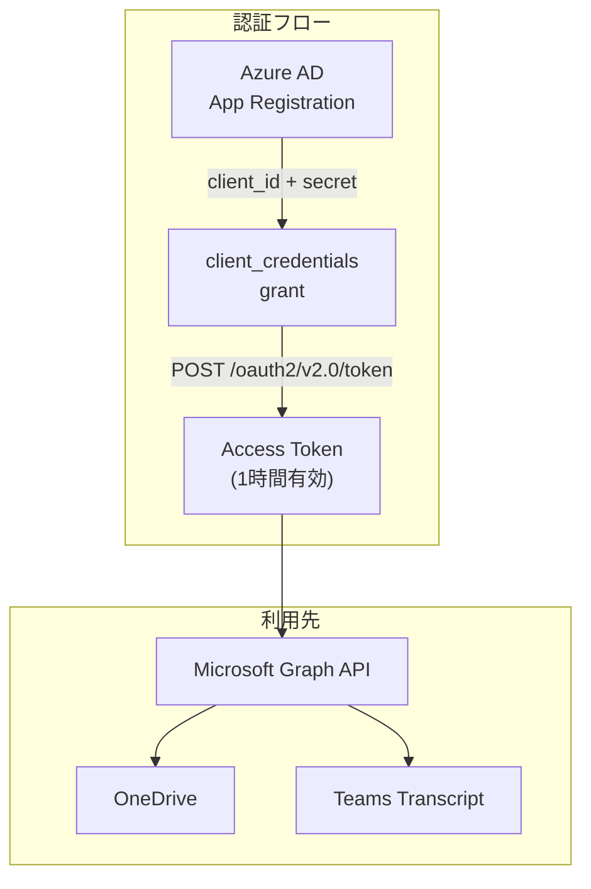
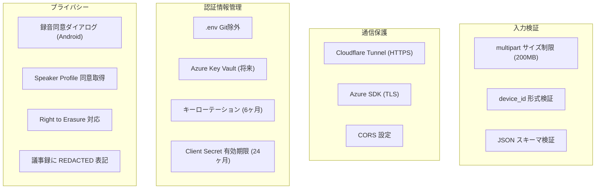
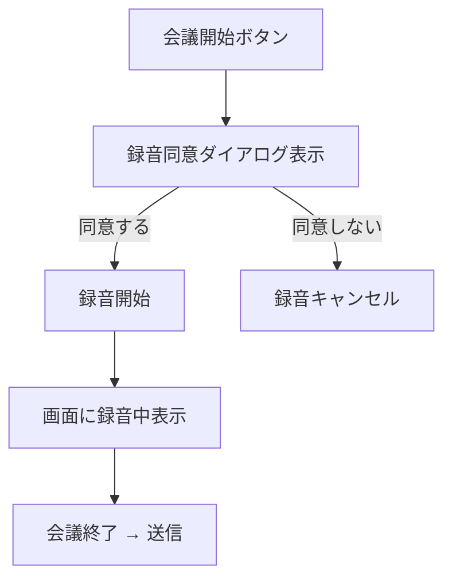
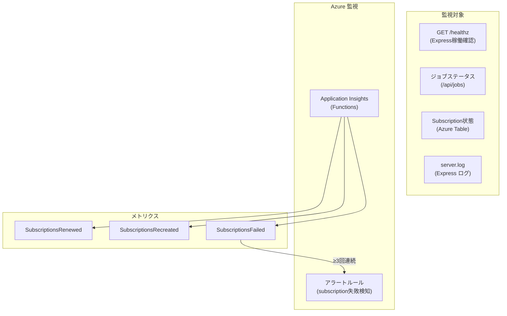
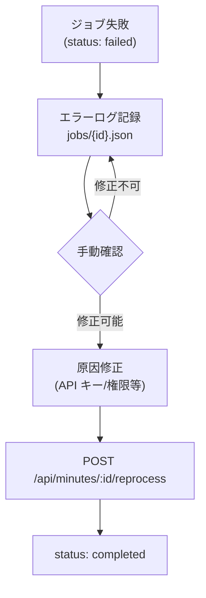
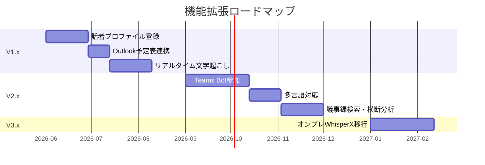

# 7. セキュリティ・運用設計

**最終更新**: 2026-05-15

---

## 7.1 認証・認可設計



### Azure AD App 必要権限 (Application permissions)

| API | 権限 | 用途 |
|---|---|---|
| Microsoft Graph | Files.ReadWrite.All | OneDrive 書込 |
| Microsoft Graph | Sites.ReadWrite.All | SharePoint 書込 |
| Microsoft Graph | OnlineMeetings.Read.All | Teams 会議メタ取得 |
| Microsoft Graph | OnlineMeetingTranscript.Read.All | Teams Transcript取得 |
| Microsoft Graph | User.Read.All | 出席者情報取得 |
| Microsoft Graph | Calendars.Read | Outlook予定表連携 |

> すべて **Admin consent** が必要。IT管理者への依頼が必須。

### API キー認証

| サービス | 認証方式 | キー名 |
|---|---|---|
| Azure Speech | ヘッダー `Ocp-Apim-Subscription-Key` | AZURE_SPEECH_KEY |
| Azure Speaker Recognition | ヘッダー `Ocp-Apim-Subscription-Key` | SPEAKER_RECOGNITION_KEY |
| Anthropic Claude | ヘッダー `x-api-key` | ANTHROPIC_API_KEY |
| Azure Storage | ConnectionString | AZURE_STORAGE_CONNECTION_STRING |

---

## 7.2 データ保護

### データ分類と保管方針

| データ | 機密度 | 保管先 | 保管期間 | 暗号化 |
|---|---|---|---|---|
| 音声ファイル (.m4a) | 高 | Express PC recordings/ | 議事録完了後7日で削除 | TLS in transit |
| Transcript JSON | 中 | Express PC storage/transcripts/ | 90日 | TLS in transit |
| 議事録 (.docx) | 中 | OneDrive (永続) | 社内規程に準拠 | M365暗号化 |
| Speaker Profile (声紋) | 高 (生体情報) | Azure Speech Service + `storage/speaker-profiles.json` | 2年 (退職時即時削除) | Azure保存時暗号化 |
| API キー / シークレット | 最高 | .env ファイル (ローカル) | — | Git除外必須 |

### .gitignore による保護

```
.env
.env.*
!.env.example
storage/
recordings/
azurite-data/
```

---

## 7.3 セキュリティ対策



### Webhook セキュリティ

| 対策 | 実装 |
|---|---|
| clientState 検証 | 通知ごとに `WEBHOOK_CLIENT_STATE` と一致確認 |
| fail-closed | `WEBHOOK_CLIENT_STATE` 未設定時は通知を拒否 |
| validationToken | Subscription作成時の検証トークン応答 |
| HTTPS 必須 | Azure Functions の HTTPS エンドポイント |

---

## 7.4 録音同意



- Android アプリで録音開始時に **音声＋画面表示** で告知
- 議事録冒頭にも「自動文字起こし対象会議」と明記
- 就業規則・労使協定への追記が必要 (人事・法務確認)

---

## 7.5 運用手順

### ローカル開発起動

```powershell
# 方法1: 一括起動
.\start-dev.ps1

# 方法2: 個別起動
# Terminal 1: Azurite
azurite --location azurite-data --debug azurite-data/debug.log --silent

# Terminal 2: Express
cd TestDashboard
npm start

# Terminal 3: Cloudflare Tunnel
cloudflared tunnel --url http://127.0.0.1:3000
```

### スモークテスト

```powershell
.\scripts\run-smoke-test.ps1 -BASE "http://localhost:3000"
```

### ログローテーション

```powershell
.\scripts\rotate-azurite-log.ps1 -MaxSizeMB 10 -KeepDays 7
```

---

## 7.6 監視設計



### KQL クエリ例

```kusto
-- 直近24時間の更新履歴
traces
| where timestamp > ago(24h)
| where message startswith "[renew]"
| project timestamp, message, severityLevel
| order by timestamp desc
```

---

## 7.7 エラーハンドリング

### リトライ戦略

| エラー | 戦略 | 最大試行 |
|---|---|---|
| 429 Throttled | Exponential backoff (1s→2s→4s→8s→16s) | 5回 |
| 503 Service Unavailable | Exponential backoff | 5回 |
| Network timeout | Exponential backoff | 5回 |
| 401 Unauthorized | Token再取得 → 即リトライ | 2回 |
| 403 Forbidden | **リトライしない** → アラート | — |
| 400 Bad Request | **リトライしない** → ログ | — |
| 404 Subscription gone | DB上 dead → Timer次回で再作成 | — |

### ジョブ失敗時の復旧



---

## 7.8 既知の制約・リスク

| リスク | 影響 | 対策 |
|---|---|---|
| Cloudflare Tunnel URL変更 | Azure Speech が音声取得不可 | Named Tunnel or Blob経由 (PUBLISH_MODE=blob) |
| ML Kit 顔検出精度 | 後ろ向き・うつむきは未カウント | 許容範囲内として運用 |
| Azure Speech 固有名詞誤認識 | 議事録品質低下 | Custom Speech モデルで学習 |
| Claude hallucination | 誤情報拡散 | プロンプトで「推測しない」厳守 + 人手レビュー |
| 長時間会議 (>2h) | Azure Speech タイムアウト | 30分分割アップロード |
| メモリ保持型 headcount | サーバー再起動で消失 | SQLite/JSON永続化を検討 |
| Client Secret 期限切れ | Graph API 全停止 | 24ヶ月設定 + ローテーション監視 |

---

## 7.9 将来ロードマップ


