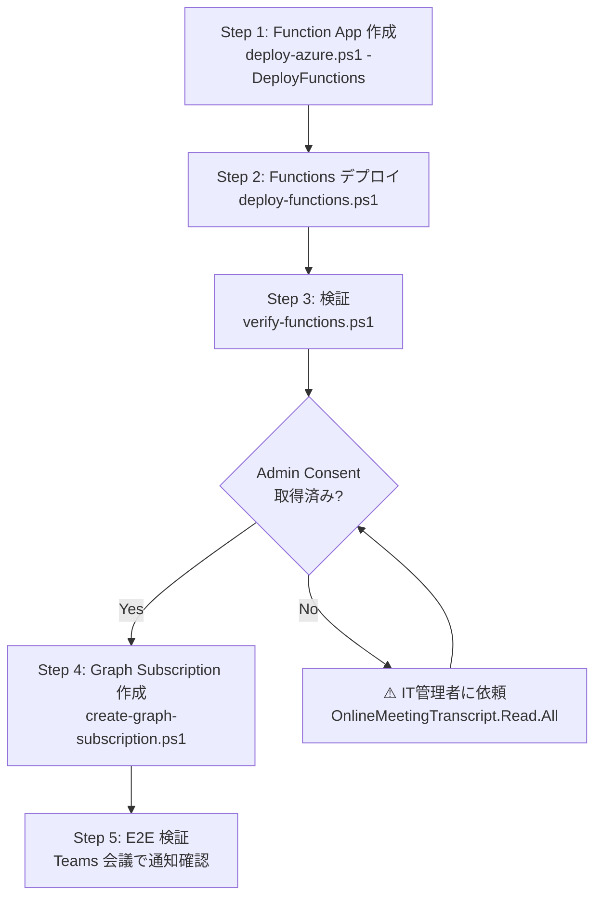

# Azure Functions 本番デプロイ手順書

**最終更新**: 2026-05-16  
**対象**: `functions/` (Teams Webhook Receiver)

---

## 前提条件

| 項目 | 状態 |
|---|---|
| Azure CLI (`az`) | ✅ インストール済み |
| Azure Functions Core Tools (`func`) | ✅ `npm i -g azure-functions-core-tools@4` |
| Azure サブスクリプション | ✅ ログイン済み |
| Storage Account + Speech | ✅ `deploy-azure.ps1` で作成済み |
| Azure AD App Registration | ✅ 作成済み (.env.azure に反映済み) |
| Admin Consent | ⚠️ Graph Subscription 作成時に必要 |

---

## デプロイフロー全体図



---

## Step 1: Function App 作成 (Bicep)

初回のみ。既に Storage / Speech がデプロイ済みの場合は `-DeployFunctions` を追加するだけ。

```powershell
cd C:\PRJ2\dev2\infra

# ドライラン (what-if) で差分確認
.\deploy-azure.ps1 -DeployFunctions -WhatIf

# 実行
.\deploy-azure.ps1 -DeployFunctions -Yes
```

**作成されるリソース:**
- Function App (Consumption Plan, Node.js 20)
- Application Insights
- App Service Plan (Dynamic/Y1)

**確認:**
- `.env.azure` に `FUNCTION_APP_NAME=meetmin-fn-dev-xxx` が反映されること

---

## Step 2: Functions コードデプロイ + App Settings 反映

```powershell
cd C:\PRJ2\dev2\infra

# フルデプロイ (npm install → publish → settings → healthcheck)
.\deploy-functions.ps1 -Yes

# 設定のみ再反映 (コード変更なし)
.\deploy-functions.ps1 -SkipDeploy -Yes

# ドライラン
.\deploy-functions.ps1 -WhatIf
```

**デプロイされる Functions:**

| Function | Route / Schedule | 用途 |
|---|---|---|
| `notifications` | POST/GET `/api/notifications` | Graph Webhook 受信 |
| `healthz` | GET `/api/healthz` | ヘルスチェック |
| `lifecycle` | POST/GET `/api/lifecycle` | Subscription ライフサイクル通知受信 |
| `subscriptions-bootstrap` | POST `/api/subscriptions-bootstrap` | Graph Subscription 初回作成 |
| `subscriptions-renew` | Timer (毎時) | Subscription 自動更新・再作成 |

**反映される App Settings:**

| Setting | ソース | 用途 |
|---|---|---|
| `AZURE_STORAGE_CONNECTION_STRING` | .env.azure (自動) | Storage 接続 |
| `AZURE_QUEUE_NAME` | .env.azure (自動) | Queue 名 |
| `AZURE_BLOB_CONTAINER` | .env.azure (自動) | Blob コンテナ名 |
| `SUBSCRIPTION_TABLE_NAME` | .env.azure (自動) | Subscription 管理テーブル名 |
| `MS_TENANT_ID` | .env.azure (手動) | Entra テナント ID |
| `MS_CLIENT_ID` | .env.azure (手動) | アプリ クライアント ID |
| `MS_CLIENT_SECRET` | .env.azure (手動) | アプリ クライアント シークレット |
| `WEBHOOK_CLIENT_STATE` | .env.azure (手動) | Webhook 検証用 secret |
| `WEBHOOK_NOTIFICATION_URL` | .env.azure (手動) | 通知 Webhook URL |
| `WEBHOOK_LIFECYCLE_URL` | .env.azure (手動) | Lifecycle Webhook URL |
| `MS_USER_UPN` | .env.azure (手動) | Subscription 対象ユーザー UPN |
| `GRAPH_SUBSCRIPTION_LIFETIME_MIN` | .env.azure (任意) | Subscription 有効期間(分) 既定 4200 |
| `SUBSCRIPTION_RENEW_BEFORE_MINUTES` | .env.azure (任意) | 更新閾値(分) 既定 720 |

---

## Step 3: デプロイ検証

```powershell
cd C:\PRJ2\dev2\infra
.\verify-functions.ps1
```

**検証項目 (7カテゴリ):**

| # | 項目 | 内容 |
|---|---|---|
| 1 | Azure リソース | Function App の存在・稼働状態 |
| 2 | Functions 一覧 | notifications, healthz, lifecycle, subscriptions-bootstrap, subscriptions-renew の存在 |
| 3 | ヘルスチェック | GET /api/healthz の応答 |
| 4 | Webhook 検証 | validationToken の正常返却 |
| 5 | POST 通知 | 空通知 → 202 応答 |
| 6 | App Settings | 全必須キーの設定確認 |
| 7 | Queue 接続 | minutes-jobs キューの存在 |

**期待結果:** `PASS=N  FAIL=0  WARN=M`
- WARN は admin consent 未取得の Graph 設定で発生（正常）

---

## Step 4: Graph Subscription 作成

> ⚠️ **前提:** Azure AD App に `OnlineMeetingTranscript.Read.All` の admin consent が必要

```powershell
cd C:\PRJ2\dev2\infra

# ドライラン
.\create-graph-subscription.ps1 -WhatIf

# 既存 Subscription 一覧のみ
.\create-graph-subscription.ps1 -ListOnly

# 作成
.\create-graph-subscription.ps1

# 特定ユーザー指定
.\create-graph-subscription.ps1 -UserId meetingbot@contoso.com
```

**Subscription 仕様:**
- リソース: `communications/onlineMeetings/getAllTranscripts`
- 有効期限: 70時間 (上限4230分)
- 通知先: Function App の `/api/notifications`

---

## Step 5: E2E 検証

### 5.1 Function App ログストリーミング

```powershell
# リアルタイムログ監視
func azure functionapp logstream <FUNCTION_APP_NAME>
```

### 5.2 Teams 会議テスト

1. Teams で会議を開始（Live Transcript を有効化）
2. 数分間会話
3. 会議終了
4. Function App ログで通知受信を確認
5. TestDashboard の `/api/jobs` で Teams ジョブ生成を確認

### 5.3 手動テスト (Webhook シミュレーション)

```powershell
$FUNC_URL = "https://<FUNCTION_APP_NAME>.azurewebsites.net/api/notifications"
$CLIENT_STATE = "<WEBHOOK_CLIENT_STATE>"

# 正常通知
curl.exe -X POST $FUNC_URL `
  -H "Content-Type: application/json" `
  -d "{`"value`":[{`"clientState`":`"$CLIENT_STATE`",`"changeType`":`"created`",`"resource`":`"communications/onlineMeetings('test-meeting')/transcripts('test-transcript')`"}]}"

# 期待: {"ok":true,"processed":1}
# → Azure Queue に メッセージが積まれる
```

---

## トラブルシューティング

| 症状 | 原因 | 対処 |
|---|---|---|
| `func publish` 失敗 | Azure CLI 未ログイン | `az login` |
| healthz が 503 | App Settings 未設定 | `deploy-functions.ps1 -SkipDeploy` |
| Webhook 検証失敗 | Function App cold start | 60秒待って再試行 |
| Graph 403 | Admin consent 未付与 | IT管理者に依頼 |
| Subscription 作成時 ExtensionError | Webhook URL 到達不可 | `curl.exe` で直接確認 |
| Queue にメッセージが入らない | Storage 接続文字列の不一致 | healthz で確認 |

---

## ファイル一覧

```
infra/
├── deploy-azure.ps1               Azure リソース作成 (Bicep)
├── deploy-functions.ps1            ★ Functions デプロイ + 設定反映
├── verify-functions.ps1            ★ デプロイ後の検証
├── create-graph-subscription.ps1   ★ Graph Subscription 作成
├── bicep/
│   ├── main.bicep
│   └── modules/
│       ├── functions.bicep         Function App テンプレート
│       ├── storage.bicep
│       └── speech.bicep
└── ...

functions/
├── notifications/                  Webhook 受信 Function
│   ├── function.json
│   └── index.js
├── healthz/                        ★ ヘルスチェック Function
│   ├── function.json
│   └── index.js
├── lifecycle/                      ★ Subscription ライフサイクル通知受信
│   ├── function.json
│   └── index.js
├── subscriptions-bootstrap/        ★ Graph Subscription 初回作成
│   ├── function.json
│   └── index.js
├── subscriptions-renew/            ★ Subscription 自動更新 (Timer)
│   ├── function.json
│   └── index.js
├── shared/                         ★ 共有モジュール
│   ├── graphAuth.js                MSALトークン取得
│   ├── subscriptionService.js      Graph API操作
│   └── subscriptionStore.js        Azure Table Storage 永続化
├── .funcignore                     ★ デプロイ除外設定
├── host.json
├── package.json
└── test/
    ├── notifications.test.js
    └── lifecycle.test.js
```
